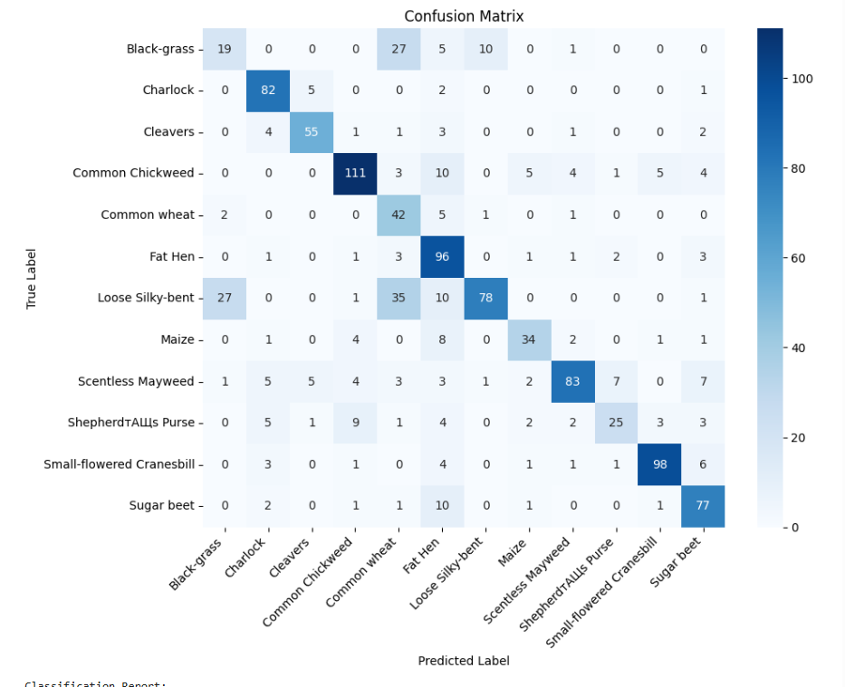

# Plant Seedling Classifier
This is a simple deep learning project for classifying plant seedlings using Kaggle’s V2 Plant Seedlings dataset.

##  Data Description  
This project uses the **V2 Plant Seedlings Dataset** from Kaggle, containing **5,539 RGB images** of **12 plant species** (both crop and weed seedlings) at early growth stages.  
Class labels are balanced and images vary in background and lighting.

### Class Distribution & Samples  

##  Data Cleaning & Preprocessing  
Images are resized to a fixed resolution, normalized to `[0,1]`, and labels encoded into integers.  
The notebook performs checks for corrupted files and ensures correct train/test splits.

##  Model Training  
We use a fast, lightweight convolutional neural network to train a model quickly—even if peak accuracy is not achieved.  
The architecture is straightforward and compiled inside a minimal runtime environment.

##  Evaluation Results  
Model performance is shown below, including accuracy and confusion matrix visualization:

## Performance Metrics  
- Overall accuracy  
- Per-class precision, recall, and F1-score  
- Confusion matrix detailing misclassifications

## Usage Instructions

1. Clone this repository.  
2. Open `CV_FT1.ipynb` in Google Colab.  
3. Upload your `kaggle.json` API key.  
4. Run notebook cells sequentially—preprocessing, training, evaluation, and inference.  
5. Upload your own images to try predictions.

